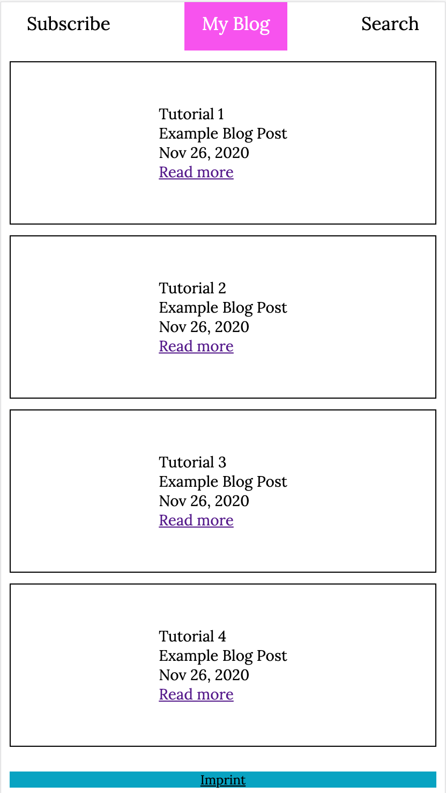
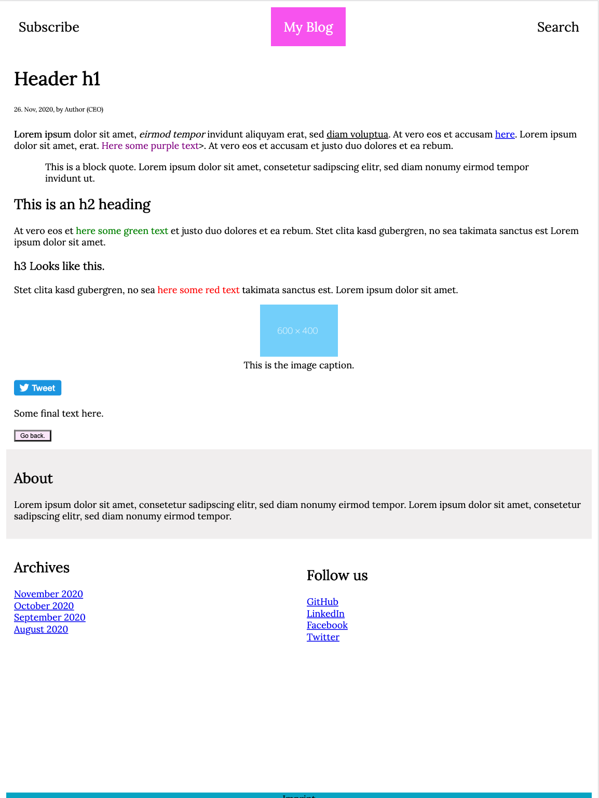

# Basic HTML and CSS Blog
In this repository I build a very basic web blog from scratch in HTMl and CSS. The blog contains only two pages - a landing/home page and one blog article page. The design is clean and responsive to small, medium and large screen sizes. The blog looks like this:

Home screen             |  Blog post screen
:-------------------------:|:-------------------------:
  |  

Clone it and extend it as you like to learn more about HTML and CSS!

## Dependencies
Download the repository and open the `index.html` file with a standard web browser such as Google Chrome. 

## File Structure
Files that might be of interest:
- index.html
- blog-post.html
- style.css
- blog-post.css
- footer.css

## Extend the Project
If you want to egt into Front End Web Development you can understand, change and extend the project. here are some suggestions:
1. Replace the dummy text and links with meaningful content.
2. Add further blog articles.
3. Extend the functionality to create an infinity scroll.
4. Deploy the project on [GitHub Pages](https://pages.github.com/) or another hosting provider that is free of charge.
5. Consider implementing a [design system](https://www.forumone.com/ideas/what-is-design-system/) for your webpage.
